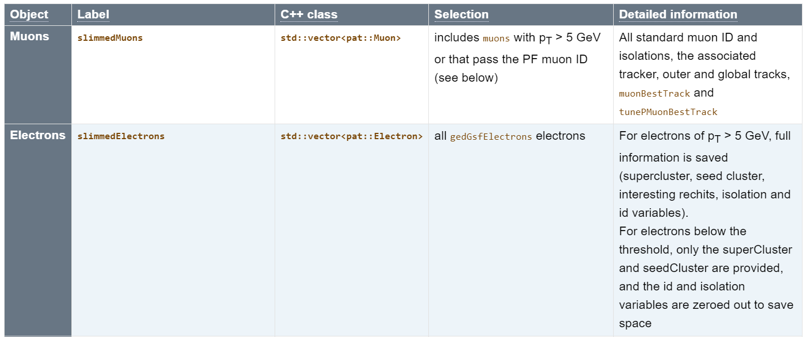

:::::::::::::::::::::::::::::::::::::: questions 

- What is the structure and content of the NanoAOD format?
- How is it different from MiniAOD?
- What if the required information is not available in the NanoAOD format?

::::::::::::::::::::::::::::::::::::::::::::::::

::::::::::::::::::::::::::::::::::::: objectives

- Learn about the structure and content of NanoAOD and how it differs from MiniAOD
- Learn where to find information on how to use MiniAOD

::::::::::::::::::::::::::::::::::::::::::::::::

## What are the differences between NanoAOD and MiniAOD

In the previous episode, we found the description of the NanoAOD variables.

Let us now compare it to the MiniAOD format. Note that the variable descriptions are not available attached to the datasets, but we can have a look at the [MiniAOD description in the CMS WorkBook](https://twiki.cern.ch/twiki/bin/view/CMSPublic/WorkBookMiniAOD2016#High_level_physics_objects).

You will see a table starting with:

{alt='MiniAOD descripion in the CMS WorkBook'}

The objects in the MiniAOD format are C++ classes in CMSSW, the CMS Software package, and the table gives the class name. We can find the exact class description in the CMSSW reference manual. See, for example 

- [`pat::Muon`](https://cmsdoxygen.web.cern.ch/cmsdoxygen/CMSSW_10_6_25/doc/html/d6/d13/classpat_1_1Muon.html) 
- [`pat::Electron`](https://cmsdoxygen.web.cern.ch/cmsdoxygen/CMSSW_10_6_25/doc/html/d2/d1f/classpat_1_1Electron.html).

These are C++ classes that can *inherit* information from parent classes or contain objects, of some complex types. Therefore, some of the variables are not explicitly listed as they are available through other objects.

For example, for MiniAOD, we will not find `eta` or `pt` explicitly in the class description as they can be obtained through the `LorentzVector` object. This is transparent in the code when accessing those values, but much less so in the documentation!

Let us now compare it to NanoAOD. The major difference is that MiniAOD contains most of the constituents of a physics object (such as tracks and/or calorimeter clusters) whereas NanoAOD only contains some information about them.

## NanoAOD with particle flow candidates

Many CMS open data users have relied on the [Particle flow information](https://twiki.cern.ch/twiki/bin/view/CMSPublic/WorkBookMiniAOD2016#Packed_ParticleFlow_Candidates), available in the MiniAOD format but not in the NanoAOD format. See the class description: [`pat::Packe](https://cmsdoxygen.web.cern.ch/cmsdoxygen/CMSSW_10_6_25/doc/html/d8/d79/classpat_1_1PackedCandidate.html).

TO-DO
find them and compare variable lists 

## Using MiniAOD

Demo only, 

show container

show edmDumpEventContent

miniAOD links for use: [Getting started with miniAOD](https://opendata.cern.ch/docs/cms-getting-started-miniaod)

::::::::::::::::::::::::::::::::::::: keypoints 

- Analyses that require detailed information about physics object constituents may require using MiniAOD instead of NanoAOD
- Selected datasets include Particle flow candidates in an enriched NanoAOD format are available and their use does not require using CMS-specific software
- CMSSW environment is available as a Docker container and can be used to work with MiniAOD

::::::::::::::::::::::::::::::::::::::::::::::::
