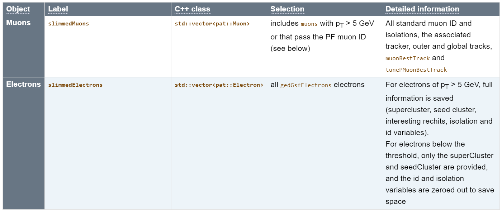

:::::::::::::::::::::::::::::::::::::: questions 

- What is the structure and content of the NanoAOD format?
- How is it different from MiniAOD?
- What if the required information is not available in the NanoAOD format?

::::::::::::::::::::::::::::::::::::::::::::::::

::::::::::::::::::::::::::::::::::::: objectives

- Learn about the structure and content of NanoAOD and how it differs from MiniAOD
- Learn where to find information on how to use MiniAOD

::::::::::::::::::::::::::::::::::::::::::::::::

## What are the differences between NanoAOD and MiniAOD

In the previous episode, we found the description of the NanoAOD variables. If you browse the listing, you will notice that all variables are of fundamental types (floating-point numbers, integers, Boolean values, characters).

Let us now compare it to the MiniAOD format. Note that the variable descriptions are not available attached to the datasets, but we can have a look at the [MiniAOD description in the CMS WorkBook](https://twiki.cern.ch/twiki/bin/view/CMSPublic/WorkBookMiniAOD2016#High_level_physics_objects).

You will see a table starting with:

{alt='MiniAOD descripion in the CMS WorkBook'}

The objects in the MiniAOD format are C++ classes in CMSSW, the CMS Software package, and the table gives the class name corresponding to the physics object. We can find the exact class description in the CMSSW reference manual. See, for example 

- Muons: [`pat::Muon`](https://cmsdoxygen.web.cern.ch/cmsdoxygen/CMSSW_10_6_25/doc/html/d6/d13/classpat_1_1Muon.html) 
- Electrons: [`pat::Electron`](https://cmsdoxygen.web.cern.ch/cmsdoxygen/CMSSW_10_6_25/doc/html/d2/d1f/classpat_1_1Electron.html).

These are C++ classes that can *inherit* information from parent classes, or contain objects of some complex types. Therefore, some of the variables are not explicitly listed as they are available through other objects.

::::::::::::::::::::: challenge

## Exercise 1: Find NanoAOD variables in MiniAOD

Compare the physics object information available in NanoAOD and MiniAOD.

Can you find the basic variables such as `charge`, `eta` and `pt` for electrons?


:::::::::::::: solution

For NanoAOD, see for example the [SingleElectron dataset](https://opendata.cern.ch/eos/opendata/cms/dataset-semantics/NanoAOD/30529/SingleElectron_doc.html).

For MiniAOD, read the general description in the [WorkBook](https://twiki.cern.ch/twiki/bin/view/CMSPublic/WorkBookMiniAOD2016#High_level_physics_objects) and open the reference page for [`pat::Electron`](https://cmsdoxygen.web.cern.ch/cmsdoxygen/CMSSW_10_6_25/doc/html/d2/d1f/classpat_1_1Electron.html).

For MiniAOD, we will not find `eta` or `pt` explicitly in the class description as they can be obtained through the `LorentzVector` object. This is transparent in the code when accessing those values, but much less so in the documentation!

::::::::::::::

::::::::::::::::::::

Let us now see what information is in MiniAOD but not in NanoAOD. The major difference is that MiniAOD contains most of the constituents of a physics object (such as tracks and/or calorimeter clusters) whereas NanoAOD only contains some information about them.

::::::::::::::::::::: challenge

## Exercise 2: Find MiniAOD information that is not in NanoAOD

Compare the physics object information available in NanoAOD and MiniAOD.

Find information about the calorimeter cluster and the track connected to an electron.


:::::::::::::: solution

In MiniAOD, access to the track information is provided through a member function `gsfTrack`. 

The full track information is not available in NanoAOD, but the most pertinent information from its associated track is its impact parameter with respect to the primary interaction vertex. This information is available in NanoAOD, read more about it in the [pre-learning material](https://cms-opendata-workshop.github.io/workshop2024-lesson-physics-objects/instructor/02-electrons.html#electron-4-vector-and-track-information).

::::::::::::::

::::::::::::::::::::

## NanoAOD with Particle Flow candidates

Many CMS open data users have relied on the [Particle Flow information](https://twiki.cern.ch/twiki/bin/view/CMSPublic/WorkBookMiniAOD2016#Packed_ParticleFlow_Candidates), available in the AOD and MiniAOD formats but not in the NanoAOD format. See the class description: [`pat::PackeedCandidate`](https://cmsdoxygen.web.cern.ch/cmsdoxygen/CMSSW_10_6_25/doc/html/d8/d79/classpat_1_1PackedCandidate.html).

For the 2016 collision data, a selection of datasets has been processed in NanoAOD format enhanced with Particle Flow information. These datasets can be used in the same way as the usual NanoAOD datasets, they just contain more information.

::::::::::::::::::::: challenge

## Exercise 3: Find the datasets in NanoAOD format enhanced with Particle Flow information

Use the [CERN Open Data portal search facets](https://opendata.cern.ch/search?q=&l=list&order=desc&p=1&s=10&sort=mostrecent) to find these derived datasets.

Hint: look at the options under "File type".

Compare the variable list with the standard NanoAOD.

:::::::::::::: solution

You can find them by [searching `nanoaod-pf`](https://opendata.cern.ch/search?q=&f=file_type%3Ananoaod-pf&l=list&order=desc&p=1&s=10&sort=mostrecent).

Select one, find the variable list. Note the section called [`PFCands`](https://opendata.cern.ch/eos/opendata/cms/dataset-semantics/derived-data/PFNano/31312/SingleElectron_doc.html#PFCands) with information about Particle Flow candidates.

::::::::::::::

::::::::::::::::::::

An [example workflow](https://opendata.cern.ch/record/12504) is provided (and linked to the dataset record) to show how other datasets can be processed into this enhanced format. In principle, it can be used as such, just changing the MiniAOD input dataset name, executing the code in the CMSSW Docker container.

::::::::::::: callout

## Processing MiniAOD to custom NanoAOD takes time and resources

Processing an entire MiniAOD to custom NanoAOD (i.e. selecting your own objects of interest in addition to those already available in NanoAOD) takes computing resources well beyond a single computer. 

:::::::::::::


## Using MiniAOD

If you need the maximum coverage of CMS physics objects, know that CMS provides all that is needed to use data in the MiniAOD format.

You would first find the [CMSSW container image](https://opendata.cern.ch/docs/cms-guide-docker#images) with a version corresponding to the data release, and you would [start a container](https://opendata.cern.ch/docs/cms-guide-docker#mount) in a similar manner as you did for the Python tools and Root containers that we will use in the workshop.

We will **not** work through it now but if you started the CMSSW container, you would get a container prompt with the CMSSW working area:

```bash
CMSSW should now be available.
This is a standalone image for CMSSW_10_6_30 slc7_amd64_gcc700.
(/code/CMSSW_10_6_30/src)
```

In this environment, you would be able to follow the instructions in [Getting started with miniAOD](https://opendata.cern.ch/docs/cms-getting-started-miniaod), and, for example, inspect the event content with CMSSW tools, e.g. with `edmDumpEventContent`.

:::::::::::::::: spoiler

### See the MiniAOD event content

Find a file name in the file listing of the [SingleElectron MiniAOD record](https://opendata.cern.ch/record/30512) and dump its contents with

```bash
(/code/CMSSW_10_6_30/src) edmDumpEventContent root://eospublic.cern.ch//eos/opendata/cms/Run2016G/SingleElectron/MINIAOD/UL2016_MiniAODv2-v2/120000/0014ADC0-08B8-1347-B496-CDB3A3A32317.root
Type                                  Module                      Label             Process
----------------------------------------------------------------------------------------------
edm::TriggerResults                   "TriggerResults"            ""                "HLT"
BXVector<GlobalAlgBlk>                "gtStage2Digis"             ""                "RECO"
BXVector<GlobalExtBlk>                "gtStage2Digis"             ""                "RECO"
BXVector<l1t::EGamma>                 "caloStage2Digis"           "EGamma"          "RECO"
BXVector<l1t::EtSum>                  "caloStage2Digis"           "EtSum"           "RECO"
BXVector<l1t::Jet>                    "caloStage2Digis"           "Jet"             "RECO"
BXVector<l1t::Muon>                   "gmtStage2Digis"            "Muon"            "RECO"
BXVector<l1t::Tau>                    "caloStage2Digis"           "Tau"             "RECO"
HcalNoiseSummary                      "hcalnoise"                 ""                "RECO"
L1GlobalTriggerReadoutRecord          "gtDigis"                   ""                "RECO"
double                                "fixedGridRhoAll"           ""                "RECO"
double                                "fixedGridRhoFastjetAll"    ""                "RECO"
double                                "fixedGridRhoFastjetAllCalo"   ""                "RECO"
double                                "fixedGridRhoFastjetAllTmp"   ""                "RECO"
double                                "fixedGridRhoFastjetCentral"   ""                "RECO"
double                                "fixedGridRhoFastjetCentralCalo"   ""                "RECO"
double                                "fixedGridRhoFastjetCentralChargedPileUp"   ""                "RECO"
double                                "fixedGridRhoFastjetCentralNeutral"   ""                "RECO"
edm::TriggerResults                   "TriggerResults"            ""                "RECO"
reco::BeamHaloSummary                 "BeamHaloSummary"           ""                "RECO"
reco::BeamSpot                        "offlineBeamSpot"           ""                "RECO"
reco::CSCHaloData                     "CSCHaloData"               ""                "RECO"
vector<CTPPSLocalTrackLite>           "ctppsLocalTrackLiteProducer"   ""                "RECO"
vector<LumiScalers>                   "scalersRawToDigi"          ""                "RECO"
vector<l1extra::L1EmParticle>         "l1extraParticles"          "Isolated"        "RECO"
vector<l1extra::L1EmParticle>         "l1extraParticles"          "NonIsolated"     "RECO"
vector<l1extra::L1EtMissParticle>     "l1extraParticles"          "MET"             "RECO"
vector<l1extra::L1EtMissParticle>     "l1extraParticles"          "MHT"             "RECO"
vector<l1extra::L1HFRings>            "l1extraParticles"          ""                "RECO"
vector<l1extra::L1JetParticle>        "l1extraParticles"          "Central"         "RECO"
vector<l1extra::L1JetParticle>        "l1extraParticles"          "Forward"         "RECO"
vector<l1extra::L1JetParticle>        "l1extraParticles"          "IsoTau"          "RECO"
vector<l1extra::L1JetParticle>        "l1extraParticles"          "Tau"             "RECO"
vector<l1extra::L1MuonParticle>       "l1extraParticles"          ""                "RECO"
vector<reco::Conversion>              "gsfTracksOpenConversions"   "gsfTracksOpenConversions"   "RECO"
vector<reco::ForwardProton>           "ctppsProtons"              "multiRP"         "RECO"
vector<reco::ForwardProton>           "ctppsProtons"              "singleRP"        "RECO"
vector<reco::Track>                   "displacedStandAloneMuons"   ""                "RECO"
BXVector<GlobalExtBlk>                "simGtExtUnprefireable"     ""                "PAT"
double                                "prefiringweight"           "nonPrefiringProb"   "PAT"
double                                "prefiringweight"           "nonPrefiringProbDown"   "PAT"
double                                "prefiringweight"           "nonPrefiringProbUp"   "PAT"
edm::Association<vector<reco::DeDxHitInfo> >    "isolatedTracks"            ""                "PAT"
edm::OwnVector<TrackingRecHit,edm::ClonePolicy<TrackingRecHit> >    "slimmedMuonTrackExtras"    ""                "PAT"
edm::OwnVector<reco::BaseTagInfo,edm::ClonePolicy<reco::BaseTagInfo> >    "slimmedJetsPuppi"          "tagInfos"        "PAT"
edm::RangeMap<CSCDetId,edm::OwnVector<CSCSegment,edm::ClonePolicy<CSCSegment> >,edm::ClonePolicy<CSCSegment> >    "slimmedMuons"              ""                "PAT"
edm::RangeMap<DTChamberId,edm::OwnVector<DTRecSegment4D,edm::ClonePolicy<DTRecSegment4D> >,edm::ClonePolicy<DTRecSegment4D> >    "slimmedMuons"              ""
"PAT"
edm::SortedCollection<EcalRecHit,edm::StrictWeakOrdering<EcalRecHit> >    "reducedEgamma"             "reducedEBRecHits"   "PAT"
edm::SortedCollection<EcalRecHit,edm::StrictWeakOrdering<EcalRecHit> >    "reducedEgamma"             "reducedEERecHits"   "PAT"
edm::SortedCollection<EcalRecHit,edm::StrictWeakOrdering<EcalRecHit> >    "reducedEgamma"             "reducedESRecHits"   "PAT"
edm::SortedCollection<HBHERecHit,edm::StrictWeakOrdering<HBHERecHit> >    "reducedEgamma"             "reducedHBHEHits"   "PAT"
edm::SortedCollection<HBHERecHit,edm::StrictWeakOrdering<HBHERecHit> >    "slimmedHcalRecHits"        "reducedHcalRecHits"   "PAT"
edm::SortedCollection<HFRecHit,edm::StrictWeakOrdering<HFRecHit> >    "slimmedHcalRecHits"        "reducedHcalRecHits"   "PAT"
edm::SortedCollection<HORecHit,edm::StrictWeakOrdering<HORecHit> >    "slimmedHcalRecHits"        "reducedHcalRecHits"   "PAT"
edm::TriggerResults                   "TriggerResults"            ""                "PAT"
edm::ValueMap<float>                  "offlineSlimmedPrimaryVertices"   ""                "PAT"
pat::PackedTriggerPrescales           "patTrigger"                ""                "PAT"
pat::PackedTriggerPrescales           "patTrigger"                "l1max"           "PAT"
pat::PackedTriggerPrescales           "patTrigger"                "l1min"           "PAT"
vector<CTPPSLocalTrackLite>           "ctppsLocalTrackLiteProducer"   ""                "PAT"
vector<pat::CompositeCandidate>       "oniaPhotonCandidates"      "conversions"     "PAT"
vector<pat::Electron>                 "slimmedElectrons"          ""                "PAT"
vector<pat::Electron>                 "slimmedLowPtElectrons"     ""                "PAT"
vector<pat::IsolatedTrack>            "isolatedTracks"            ""                "PAT"
vector<pat::Jet>                      "slimmedJets"               ""                "PAT"
vector<pat::Jet>                      "slimmedJetsAK8"            ""                "PAT"
vector<pat::Jet>                      "slimmedJetsPuppi"          ""                "PAT"
vector<pat::Jet>                      "slimmedJetsAK8PFPuppiSoftDropPacked"   "SubJets"         "PAT"
vector<pat::MET>                      "slimmedMETs"               ""                "PAT"
vector<pat::MET>                      "slimmedMETsNoHF"           ""                "PAT"
vector<pat::MET>                      "slimmedMETsPuppi"          ""                "PAT"
vector<pat::Muon>                     "slimmedMuons"              ""                "PAT"
vector<pat::PackedCandidate>          "lostTracks"                ""                "PAT"
vector<pat::PackedCandidate>          "packedPFCandidates"        ""                "PAT"
vector<pat::PackedCandidate>          "lostTracks"                "eleTracks"       "PAT"
vector<pat::Photon>                   "slimmedOOTPhotons"         ""                "PAT"
vector<pat::Photon>                   "slimmedPhotons"            ""                "PAT"
vector<pat::Tau>                      "slimmedTaus"               ""                "PAT"
vector<pat::Tau>                      "slimmedTausBoosted"        ""                "PAT"
vector<pat::TriggerObjectStandAlone>    "slimmedPatTrigger"         ""                "PAT"
vector<reco::CaloCluster>             "reducedEgamma"             "reducedEBEEClusters"   "PAT"
vector<reco::CaloCluster>             "reducedEgamma"             "reducedESClusters"   "PAT"
vector<reco::CaloCluster>             "reducedEgamma"             "reducedOOTEBEEClusters"   "PAT"
vector<reco::CaloCluster>             "reducedEgamma"             "reducedOOTESClusters"   "PAT"
vector<reco::CaloJet>                 "slimmedCaloJets"           ""                "PAT"
vector<reco::Conversion>              "reducedEgamma"             "reducedConversions"   "PAT"
vector<reco::Conversion>              "reducedEgamma"             "reducedSingleLegConversions"   "PAT"
vector<reco::DeDxHitInfo>             "isolatedTracks"            ""                "PAT"
vector<reco::ForwardProton>           "ctppsProtons"              "multiRP"         "PAT"
vector<reco::ForwardProton>           "ctppsProtons"              "singleRP"        "PAT"
vector<reco::GsfElectronCore>         "reducedEgamma"             "reducedGedGsfElectronCores"   "PAT"
vector<reco::GsfTrack>                "reducedEgamma"             "reducedGsfTracks"   "PAT"
vector<reco::PhotonCore>              "reducedEgamma"             "reducedGedPhotonCores"   "PAT"
vector<reco::PhotonCore>              "reducedEgamma"             "reducedOOTPhotonCores"   "PAT"
vector<reco::SuperCluster>            "reducedEgamma"             "reducedOOTSuperClusters"   "PAT"
vector<reco::SuperCluster>            "reducedEgamma"             "reducedSuperClusters"   "PAT"
vector<reco::TrackExtra>              "slimmedMuonTrackExtras"    ""                "PAT"
vector<reco::Vertex>                  "offlineSlimmedPrimaryVertices"   ""                "PAT"
vector<reco::VertexCompositePtrCandidate>    "slimmedKshortVertices"     ""                "PAT"
vector<reco::VertexCompositePtrCandidate>    "slimmedLambdaVertices"     ""                "PAT"
vector<reco::VertexCompositePtrCandidate>    "slimmedSecondaryVertices"   ""                "PAT"
vector<string>                        "slimmedPatTrigger"         "filterLabels"    "PAT"
unsigned int                          "bunchSpacingProducer"      ""                "PAT"
```

::::::::::::::::::::::::

You would follow the [instructions](https://opendata.cern.ch/docs/cms-getting-started-miniaod#data) to build a CMSSW analyzer module of your own to select the events and physics object of interest, compile the code and run the analysis in the container. The CMSSW output files are in the ROOT format and you could use the Python tools or the Root container to analyze them further.

::::::::::::::::::::::::::::::::::::: keypoints 

- Analyses that require detailed information about physics object constituents may require using MiniAOD instead of NanoAOD
- Selected datasets include Particle flow candidates in an enriched NanoAOD format are available and their use does not require using CMS-specific software
- CMSSW environment is available as a Docker container and can be used to work with MiniAOD


::::::::::::::::::::::::::::::::::::::::::::::::
