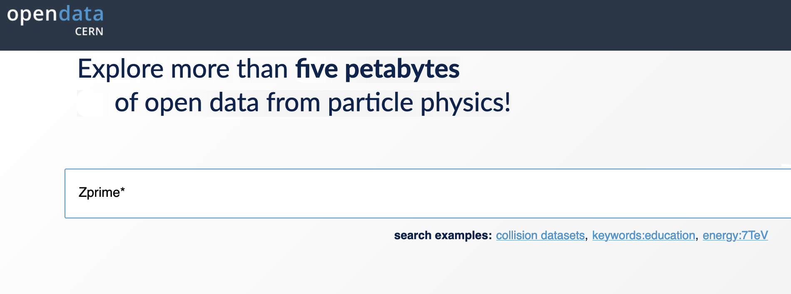
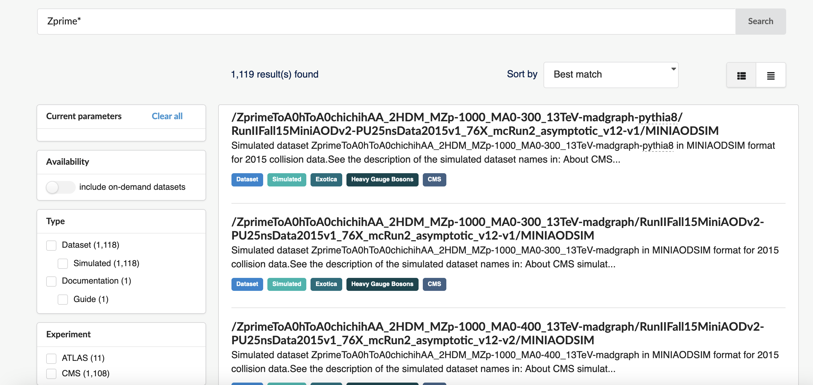
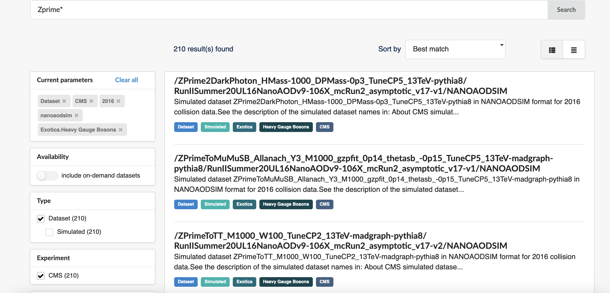
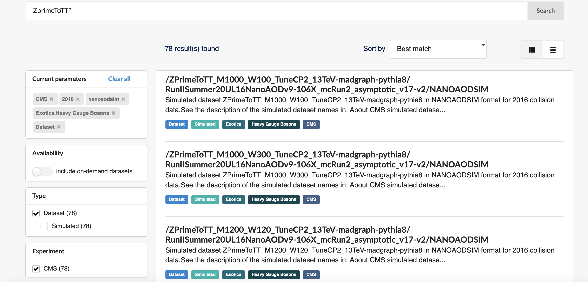
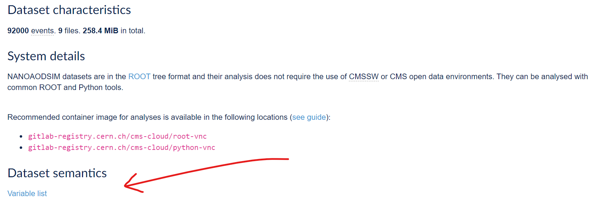
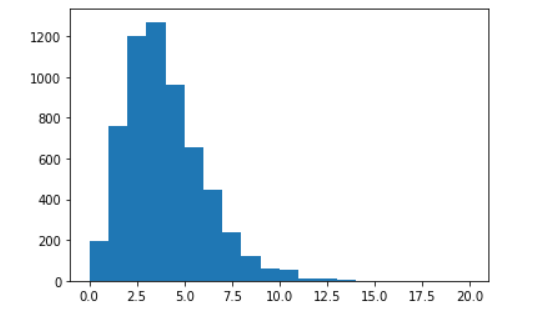
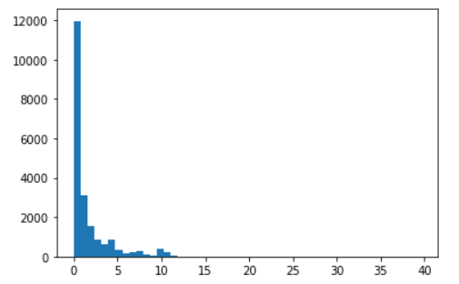

:::::::::::::::::::::::::::::::::::::: questions 

- How do we find a specific nanoAOD dataset?
- How to we explore the content of our nanoAOD dataset?

::::::::::::::::::::::::::::::::::::::::::::::::

::::::::::::::::::::::::::::::::::::: objectives

- Know how to find nanoAOD datasets
- Know how to explore the content of nanoAOD 

::::::::::::::::::::::::::::::::::::::::::::::::

## Find and explore a nanoAOD dataset

Let's find and explore a particular which we will get even further into
later: simulated Z' events in which the Z' decays to a top and antitop quark pair.

:::::: callout
A Z' ("Z-prime") is a hypothetical heavy gauge boson that could come from
extensions of the Standard Model. A review of searches for the Z' 
can be found [here](https://pdg.lbl.gov/2024/reviews/rpp2024-rev-zprime-searches.pdf)
::::::

### Find the dataset

All data can be found via the [CERN Open Data Portal](https://opendata.cern.ch).
Let's go to the website and search the simulated Z' datasets. 

Dataset naming in CMS can seem obscure but let's do something simple and search for "Zprime*":

{alt='Search for Zprime* at the CODP'}

The query results are [here](https://opendata.cern.ch/search?q=Zprime%2A&l=list&order=asc&p=1&s=10&sort=bestmatch) and you can see that there are many (over 1000) records returned:

{alt='Search results for Zprime*'}

Let's narrow down the results and select **Dataset** under Type, **CMS** under Experiment, **2016** under "Year", **nanoaodsim** under File type, and **Heavy Gauge Bosons** under Category. We've now reduced the number of [matches](https://opendata.cern.ch/search?q=Zprime%2A&f=experiment%3ACMS&f=year%3A2016&f=file_type%3Ananoaodsim&f=category%3AExotica%2Bsubcategory%3AHeavy%20Gauge%20Bosons&f=type%3ADataset&l=list&order=asc&p=1&s=10&sort=bestmatch) from over 1000 down to 210:

{alt='Narrowed search results for Zprime*'}

We can discern some of the logic behind the simulated dataset naming. "Zprime" is the particle produced and it decays to various products. We want $Z^{'} \rightarrow t\bar{t}$ which shows up as the third result so let's [narrow the search](https://opendata.cern.ch/search?q=ZprimeToTT%2A&f=experiment%3ACMS&f=year%3A2016&f=file_type%3Ananoaodsim&f=category%3AExotica%2Bsubcategory%3AHeavy%20Gauge%20Bosons&f=type%3ADataset&l=list&order=asc&p=1&s=10&sort=bestmatch) further and search with "ZprimeToTT*":

{alt='Narrowed search results for Zprime*'}

We can also discern that the dataset names also include the mass (in GeV) of the hypothetical Z' (e.g. "_M2000"). 

:::::::::::::::::: callout 

### Why such long dataset names?

CMS open data are the same files that have been used in the data analysis by CMS members. The names come from naming conventions for the production system.

Go back to the [pre-exercise](https://cms-opendata-workshop.github.io/workshop2024-lesson-dataset-scouting/instructor/03-what-data-is-available.html#monte-carlo) for a brief explanation of the simulated dataset names.

::::::::::::::::::

::::::::::::::::::::: challenge

### Exercise 1: Select a Z' mass and find the corresponding dataset

:::::::::::::: solution

Search with "ZprimeToTT_M`<mass>`" where `<mass>` is the value you selected.

::::::::::::::

::::::::::::::::::::


Next, let's use the `cernopendata-client` command-line tool to find the datasets
and fetch a file.

::::::::::::::::::::: challenge

### Exercise 2: Find a file name in the dataset

:::::::::::::: solution

Go back to the [pre-exercise](https://cms-opendata-workshop.github.io/workshop2024-lesson-dataset-scouting/instructor/04-cli-through-cernopendata-client.html) to see how to get the file names with the command-line tool.

::::::::::::::

::::::::::::::::::::

### Explore a file

We will now have a look at the file contents.

:::::::::::::::::: callout 

### How to know what variables are there?

Remember that each NanoAOD/NanoAODSIM dataset has the variable list linked to the record:

{alt='Link to the variable list in the record'}

And do not forget that the [prelearning lesson on Physics Objects](https://cms-opendata-workshop.github.io/workshop2024-lesson-physics-objects/instructor/index.html) explains them in more detail!

::::::::::::::::::

Now let us plot the value of some these variables. Open the `my_python` container 

```bash
docker start -i my_python
```

You can either write your code in a Python script, or use a jupyter notebook.

If you want to use jupyter notebooks, start jupyter-lab with

```bash
jupyter-lab --ip=0.0.0.0 --no-browser
```

Open the link given in the message on your browser. Choose the icon under “Notebook”.

::::::::::::::::::::: challenge

### Exercise 3: Explore the file with the Python tools

Open the file and print the variable names.

Make a plot of a variable that is a single number in an event, for example the number of secondary vertices.

Then plot some property of the selected variables, for example a property of the secondary vertices.

:::::::::::::: solution

Go back to the [pre-exercise](https://cms-opendata-workshop.github.io/workshop2024-lesson-cpp-root-python/instructor/06-uproot.html) to see how to open the file using uproot.

If you need exercising, try to do this without looking at the solutions!

First import the Python packages.

::::::::: spoiler

### Import

```python
import numpy as np
import matplotlib.pylab as plt

import uproot
import awkward as ak
```

:::::::::

Open the file with `uproot` and inspect the first layer.

::::::::: spoiler

### Open the file

```python
infile_name = '<your selected file>'
infile = uproot.open(infile_name)

keys = infile.keys()
print(keys)
```

:::::::::

Check what variables are available in `Events`.

::::::::: spoiler

### Inspect variables

```python
events = infile['Events']
print(events.keys())
```

Whoopsie, that was long! Note that these are the same variables as you've seen listed in the variable list linked to the record.

:::::::::

Choose first a variable that is a single number in an event, typically a number of certain objects in an event. You could take number of muons, electrons or other particles, but let us take the number of secondary vertices, `nSV`. They are points identified as starting points of a track, different from the collision point, the primary vertex. It is typically the decay point of some short-lived particle. Make a histogram.

::::::::: spoiler

### Plot values of a "per-event" variable


```python
plt.hist(events['nSV'].array())
```

or if you want the values neatly in bins with integer values:

```python
plt.hist(events['nSV'].array(), range=[0,20], bins=20)
```

{alt='Plot of number of secondary vertices'}

:::::::::

Then, choose a variable of a physics object that can be many in a single event. You could take the pt values of electrons or muons, or if we remain with the secondary vertices, take for example `SV_dxy`, the 2D decay length in cm.

This is now a *jagged* array and to plot the values, you will need to use the `flatten()` function from `awkward`.

But first, inspect the array elements to see the multiple values per event

::::::::: spoiler

### Inspect the array by printing some elements

Print the number or secondary vertices per event (the value we just plotted):

```python
print(events['nSV'].array())
```

Now, print the 2D decay lengths:

```python
print(events['SV_dxy'].array())
```

and some single elements of it so that you see that the lenght of corresponds to the number of secondary vertices:

```python
print(events['SV_dxy'].array()[0])
print(events['SV_dxy'].array()[1])
print(events['SV_dxy'].array()[2])
print(events['SV_dxy'].array()[3])
```

:::::::::


::::::::: spoiler

### Use the `flatten()` function to plot the values

```python
plt.hist(ak.flatten(events['SV_dxy'].array()), bins=50)
plt.show()
```

{alt='Plot of 2d decay length of secondary vertices'}

:::::::::

::::::::::::::


::::::::::::::::::::


::::::::::::::::::::::::::::::::::::: keypoints 

- Use search facets and text search with wildcards to narrow your search.
- You can find the variable names with a brief explanation from the record, explained more in detail in the prelearning lesson and print them out directly from the file.
- NanoAOD files can be opened using the `uproot` package and the `awkward` packaged can be use to handle varying-length arrays. 

::::::::::::::::::::::::::::::::::::::::::::::::

